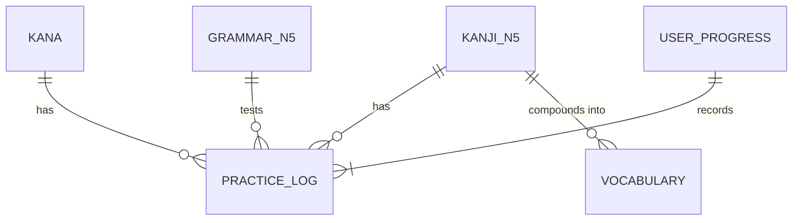

# Japanese N5 Curriculum & Database Architecture

Skill này định hướng kiến trúc cơ sở dữ liệu và giải pháp lưu trữ offline-first cho Web App học tiếng Nhật, đảm bảo ứng dụng tải nhanh tức thì (dưới 1 giây), hoạt động mượt mà không cần mạng Internet liên tục và hỗ trợ đồng bộ dữ liệu người dùng.

---

## 1. Mô Hình Thực Thể Quan Hệ (Data Model)

1. **Entities Cố định (Static Knowledge Base):**
   - Lưu tại `/data/kana/`, `/data/kanji_n5/`, `/data/vocab_n5/`, `/data/grammar_n5/`.
   - Có thể nạp vào bộ nhớ (In-memory) hoặc cache bằng IndexedDB với Service Worker.
2. **Entities Tiến độ Học viên (Dynamic User State):**
   - `user_practice_stats`: Ghi lại số chữ đã luyện (vd: `Đã luyện: 15 / 103 chữ Kanji`), điểm độ chuẩn nét trung bình (`Accuracy`).
   - `srs_cards`: Quản lý chu kỳ ôn tập ngắt quãng (Spaced Repetition).

---

## 2. Thuật Toán Lặp Lại Ngắt Quãng (SRS - Spaced Repetition)

Áp dụng biến thể tối ưu của thuật toán SM-2 (SuperMemo) để quyết định thời điểm từ vựng hoặc chữ Hán xuất hiện lại trong các trò chơi:

$$I(1) = 1 \text{ ngày}, \quad I(2) = 3 \text{ ngày}, \quad I(n) = I(n-1) \times EF$$

Trong đó $EF$ (Ease Factor - Hệ số ghi nhớ) được tính:
$$EF' = EF + (0.1 - (5 - q) \times (0.08 + (5 - q) \times 0.02))$$
- $q$: Điểm chất lượng câu trả lời của học viên từ 0 (quên hoàn toàn / viết sai nét) đến 5 (thuộc làu / viết nét chuẩn 100%).

---

## 3. Chiến Lược Caching & Offline Storage

- **LocalStorage:** Lưu trữ cấu hình giao diện người dùng:
  - `theme`: 'dark' | 'light'
  - `grid_type`: 'mizi' (米) | 'tian' (田) | 'jing' (井)
  - `brush_type`: 'felt' (Bút dạ) | 'brush' (Bút lông)
  - `show_faint_strokes`: true | false
- **IndexedDB (thông qua Dexie.js hoặc IDB-Keyval):**
  - Lưu trữ toàn bộ lịch sử nét vẽ (Stroke points stream), thống kê chuỗi ngày học liên tục (Streak), và kho đề thi thử đã làm.
- **Progressive Web App (PWA):**
  - Cho phép người dùng cài đặt ứng dụng trực tiếp lên màn hình chính máy tính hoặc điện thoại, học mọi lúc mọi nơi ngay cả khi mất mạng.
